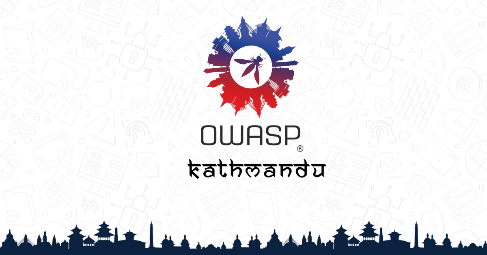

---

layout: col-sidebar
title: OWASP Kathmandu
tags: OWASP Kathmandu
level: 0
region: Asia
country: Nepal
meetup-group: owasp-kathmandu-chapter

---

## Greetings
Namaste and welcome to the **OWASP Kathmandu** group from the beautiful country Nepal. 
OWASP Kathmandu local chapter is a community of aspirants and enthusiasts in the Information Security domain to help improve application security, build a robust community, interact through various events and meetups, and represent the Nepalese infosec community globally.

**OWASP Kathmandu** community is committed to educating people about application security awareness and challenges.We strongly believe in improving software security and work tirelessly to make the world safer. We need to work together as a community to achieve this goal.
Application security is a broad term encompassing many areas, including secure coding practices, code review, threat modeling, security testing, cryptography, and network security. Each of these areas is a topic on its own, but they all fall under the application security category. While there are many different factions within the application security community, there are two main groups of people who want to improve the security of applications: Developers and Security Professionals. Each group brings different skills and expertise to the table, and they must work collaboratively where we as a community will educate, practice, and spread the word! Our core goal is to advance application security and share information about the latest research and best practices in this field.

## Participation
Everyone is welcome and encouraged to participate in [Local Chapters](/chapters),  [Events](/events/), Online Groups and [Community Page](https://www.facebook.com/owasp.kathmandu/)
Everyone is welcome and encouraged to participate in our [Projects](/projects/), [Local Chapters](/chapters/), [Events](/events/), [Online Groups](https://groups.google.com/a/owasp.com/). We especially encourage diversity in all our initiatives. OWASP is a fantastic place to learn about application security, to network, and even to build your reputation as an expert. We also encourage you to be [become a member](/membership/) or consider a [donation](/donate/) to support our ongoing work.

Next Meeting/Event <!-- You should keep this section as it will populate your meetup events -->
---------------------


